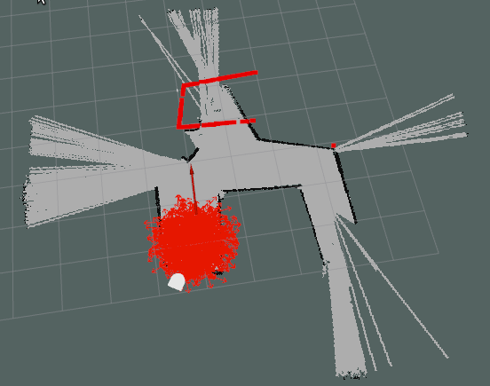

# Robot Localization by Particle Filter
## Luke Nonas-Hunter | Sam Kaplan
### Computational Robotics Fall 2020 | Prof. Paul Ruvolo and Prof. Melinda Malley

This is the second project of Introduction to Computational Robotics at Olin College of Engineering. 

In order to familiarize ourselves with the way robots localize themselves in an environment, we (tried to) implement a particle filter using ROS and Gazebo. 

Initially, we were presented with two project directions: given a fairly accurate initial robot position, implement a particle filter to correct drift caused by non-ideal motor encoders (or odometry data) OR try to solve the robot kidnapping problem, where you have no idea where the initial robot position is. 

In real robotics applications, it seems more likely that a given robot would not be given an initial position, so we chose to solve the robot kidnapping problem. 

* [High Level](#high-level)
* [Design Decisions](#design-decisions)
* [Performance](#performance)
* [Challenges](#challenges)
* [Improvements](#improvements)
* [Lessons Learned](#lessons-learned)

 

## High Level

Largely abstracted, our signal process flow looks like this

 

### **Initialize Particles**

Like my mom used to say, we have to start somewhere. This process places an intital amount of particles within the map bounds. This is done once, at the beginning. The number of initial particles is set in the initalize function. When given the initial pose of the robot we found that you can start with roughly 80% less particles than when you are unsure of the robot's starting position. This is because when you are unsure of the robots position you must place enough particles to cover the entire map (roughly 5000-20000 particles). Otherwise, you just have to place enough to cover a (roughly) 1m radius circle aournd the initial pose. 

These are not exact values, seeing as we never completely solved the localization problem. 
  

### **Initialize Weights**

In order to compute the liklihood of our robot being at a given particle location, the particles must have weights. Later, these will be assigned based on laser scan data, however when they are initialized we assume all particles to have an equal weight.
  

### **Normalize**

To treat our particles as a probablility distrubution, the sum of all the weights must equal 1 (i.e. the probability of our robot being at any particle must be 100%). We normalize our distrubution using this following function:

    old_weights = [p.w for p in self.particle_cloud]
    for p in self.particle_cloud:
        p.w = float(p.w)/sum(old_weights)

This function assigns each particle weight its unnormalized weight divided by the sum of the unnormalized distribution. If the particles have already been normalized this function will divide each weight by 1 which will not change the value. 
  

### **Guess Robot Pose**

Based on our normalized weights, we can make an educated guess about where our robot is. The techniques for this vary from simply picking the highest weight particle, to an average of a certain percentage of ideal particles.

We tried a couple different ones, but ultimately ended up picking the highest weighted particle. 
  

### **Resample**

Resampling is one of the most important parts of a particle filter algorithm. Generally it entails picking some good particles, placing new ones around them, and deleting the others. 

We played around with many different methods. Our current process takes the top N% of particles, keeps them, and resamples the remaing 1 - N% around them using Paul's draw_random_sample() function. 

We decrease our particle count using a sigmoid mapping function, which allows us to specify what number particles we start at, P, the number of particles we stabilize at, and at what iteration of resample we should be at P/2 particles. You can see the method here: 

    def sigmoid_function(value, max_output, min_output, middle, inc=1):
        particle_difference = max_output - min_output
        exponent = inc * (value - (middle/2))
        return int(particle_difference/(1 + np.exp(exponent)) + min_output)
  

### **Deadreckoning**

We must also account for the fact that our robot is moving, by apply that transformation to each particle. To deadreckon, we must be able to access the new robot pose and the old robot pose. Luckily we can do this pretty easily using ROS. 

We assume that any given robot movement can be described by a rotation Theta1, a movement along a vector facing Theta1, and a final rotation Theta2:

After our first deadreckon process, weights are no longer assigned randomly, but based on a comparison between the robots laser scan data and what that data would look like at a given particle position. 

Our deadreckoning process is described below: 

    direction = math.atan2(delta_y, delta_x)
    theta_1 = self.transform_helper.angle_diff(direction, self.current_odom_xy_theta[2])
    distance = math.sqrt((delta_x**2) + (delta_y**2))

    for p in self.particle_cloud:
        dx = distance * np.cos(p.theta + theta_1)
        dy = distance * np.sin(p.theta + theta_1)

        p.x += dx + np.random.normal(0,0.001) # Change in x plus noise
        p.y += dy + np.random.normal(0,0.001) # Change in y plus noise
        p.theta += delta_theta + np.deg2rad(np.random.normal(0,0.05)) # Change in theta plus noise

    self.current_odom_xy_theta = new_odom_xy_theta

One very large pain point was that we operating under the assumption of a correctly implemented deadreckon process for large portion of process. That turned out to be dangerous one. We should have initially tested more rigorously, isolating only this function and testing with one particle. 

Our main logic error was assuming the result of atan2(y, x), gave an absolute theta1 value. In reality, that value is in the Neato's local odometry frame, and we needed the difference between that and the global map frame.

There were also some plagueing radian/degree convention issues...
  

## Design Decisions

1. Our first initial decion was to use addition ROS scafolding (given by pf_scaffold.py). Our learning goals were more focused on the mathematical processes of the particle filter algorithm rather then to learn how to use ROS frame transformations. Thankfully, we were provided with such transformations to begin with. 

2. Second, we had to adjust the given control flow somewhat to adapt for the kidnapping problem. We ended up making our code able to attempt the problem whether it was given an initial pose or not. This came in handy when we realized we need to debug more rigorously, and needed the framework of the "easier" problem. 

3. In all honesty, we probably could have used the given control flow framework, but it just didn't make sense to normalize particle weights that weren't assigned yet. In the interest of readability, we changed it to what we have above, however I'm sure Paul has his reasons and this may actually have contributed to the deterioration of our code. 

4. Another important design decision (which was made fairly late in the process), was to create a separate ROS node which publishes our particle cloud at any given moment. We wanted to create a live visual debugger for a long time, but it wasn't absolutely necessary until we needed to see what happening to our probability distrubution during resampling. Making graphs that update themselves is hard, and even harder with such a monolithic block of code like the particle filter. So we abstracted it to a ROS node, which, graph issues aside, worked beautifully. Right now we are only visualizing our resampling step, however this framework can be used to visualize anything from within our particle filter. You can see an example of this below: 

    

5. We knew that tackling the kidnapping problem would mean we would need to be more conscious of our code efficiency. We took every oppurtunity to gain a percentage point, from using list comprehension instead of regular for loops to numpy matrix math when we compare laser scan values. As a result, we ended up spending a significant amount of time testing/reading about numpy functions and efficient algorithmic sorting. 

6. Sigmoid function mapping during resampling. We wanted a non linear device to converge the amount of particles, and a sigmoid function seemed convienent. Given we think a large source of error lies in our resample process, this decion is very suspect. 

 

## Performance

Unfortunately, we never *quite* got a working particle filter. Below you can see our attempt for the kidnapping problem:

  

After that we attempted to localize with a given pose, we seemed to *almost* be able to localize, but again, no dice. 

  

## Challenges

* Coordinate frame transformations.

* Effective unit testing.

* Black box of numpy trig functions led to many unnoticed unit errors.

* In general we assumed a greater working knowledge of trigonometry than we actually had...

 

## Improvements

The solving of the kidnapping problem depends on code efficiency (more particles = better localization) much more than accurate comparisons of particle data (a la given an initial condition). 

That being said, we could have significantly improved our efficiency by: 

* Manual code profiling to provide insight on which particular sections of code are running slow. Given that information we can work on improving. 
* Using numpy features that allow parallelization of code. This largely depends on the above (i.e. the ability to see exactly what part of our code we need to improve). Otherwise we are optimizing blind. 
* Different methods of "corner cutting" (i.e. comparing every third laser scan point instead of every other one)
* Different methods of resampling. Like above, this is largely arbitrary trial-and-error, and thus a significant time sink. 

## Lessons

* Became much more familiar with the numpy library
* Practiced small step coding practices, with rigorous testing of unknown functions. This lead to a decrease in overall debugging time. 
