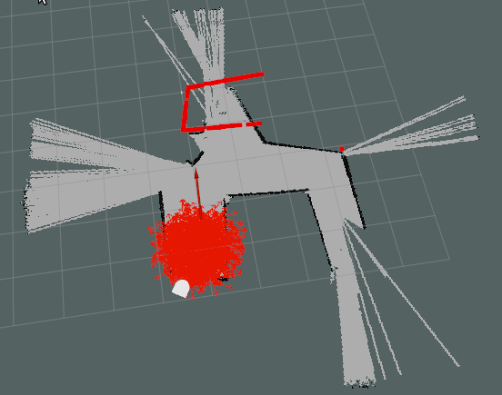
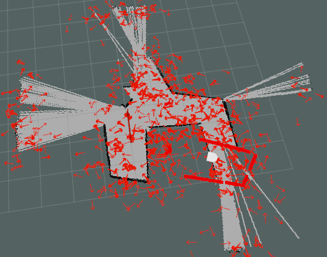

# Bag File Explanation

## pf_initial_pose.bag

This bag file contains a test of the particle filter using a given initial pose. The filter starts with 500 particles which decays overtime to 200 particles. Sadly, the particles never converge on the actual position of the robot.

  

## pf_kidnapping_problem.bag

This bag file contains a test of the particle filter where an initial pose is not given (the kidnapping problem). The filter starts with 2000 particles which decays overtime to 200 particles. Sadly, the particles never converge on the actual position of the robot.

  